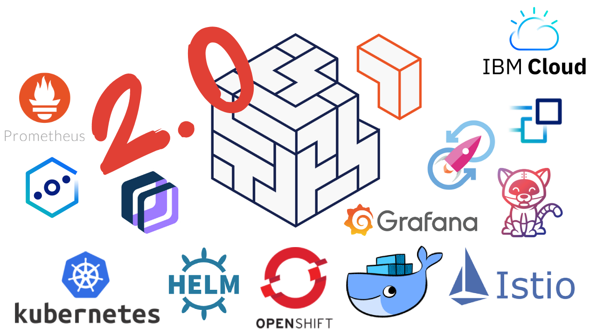

# Modernización de Aplicaciones 2.0 - Dojo

  

**¡Bienvenido al dojo de Modernización de Aplicaciones 2.0!**

Para comenzar, este dojo es la versión actualizada del dojo de modernización de aplicaciones por lo tanto gran parte del  material va a estar extraído de la versión anterior (https://github.ibm.com/IBMInnovationLabUy/dojo-modernizacion-aplicaciones).

  No hace falta tener conocimientos previos de ninguna de las temáticas que abordaremos ya que partiremos desde conceptos muy básicos. A lo largo del dojo iremos conociendo distintas tecnologías, herramientas, plataformas y arquitecturas que nos permitirán comprender qué es esto de "Modernizar Aplicaciones". El dojo está dividido en secciones donde cada una es una introducción a una temática, a su vez se proporcionan labs practicos para fortalecer y expandir el conocimiento adquirido junto con con material extra y desafíos para que realice! Al finalizar el dojo será capaz de comprender la tecnología de contenedores, podrá generar sus propias imágenes y realizar despliegues de forma local y en la nube utilizando distintas plataformas como Docker, Kubernetes y OpenShift. También aprenderá los principios de la arquitectura de microservicios y a usar herramientas que le faciliten su implementación como Istio. En la última sección también veremos cómo podemos implementar DevOps para hacer más ágiles y eficientes nuestros desarrollos y despliegues en la nube. 

Utilice el menú de aquí debajo para navegar por el dojo, ¡Éxitos!

## Índice
* [**¿Que es un Contenedor?**](/pages/1#que-es-un-contenedor)

    - [¿Máquinas virtuales o contenedores?](/pages/1#máquinas-virtuales-o-contenedores)
    - [Máquinas Virtuales, ¿Qué son?](/pages/1#--máquinas-virtuales-qué-son)
    - [Contenedores](/pages/1#--contenedores)
    - [¿Qué es Docker?](/pages/1#qué-es-docker)
    - [Comparación entre Docker y Máquinas Virtuales](/pages/1#comparación-entre-docker-y-máquinas-virtuales) 
    - [Ventajas de los contenedores](/pages/1#ventajas-de-los-contenedores)
 

* [**Docker**](/pages/2#docker)
  - [Introducción](/pages/2#docker)
  - [Instalación y configuración](/pages/2#instalación-y-configuración) 
  - [Hello World](/pages/2/#hello-world) 
  - [Crear y ejecutar una imagen propia](/pages/2/#crear-y-ejecutar-una-imagen-propia)
    - [Paso 1 - dockerfile](/pages/2/#paso-1---dockerfile)
    - [Paso 2 - dockerignore](/pages/2/#paso-2---dockerignore)
    - [Paso 3 - build](/pages/2/#paso-3---build)
    - [Paso 4 - run](/pages/2/#paso-4---run)
  - [Capas de Imagenes](/pages/2/#Las-imágenes-están-formadas-en-capas) 
  - [Docker Hub](#)
    - [¿Qué es?](/pages/2/#qué-es)
    - [Crear una cuenta e iniciar sesion](/pages/2/#crear-una-cuenta-e-iniciar-sesion)
    - [Subir nuestra imagen](/pages/2/#subir-nuestra-imagen)
    - [Catálogo](/pages/2/#catálogo)
    - [Descargar y ejecutar Mongo DB desde Docker Hub](/pages/2/#descargar-y-ejecutar-mongo-db-de-docker-hub)
      - [¿Cómo lo utilizo?](/pages/2/#cómo-lo-utilizo)
  - [Container Registry (IBM Cloud)](/pages/2/#container-registry-ibm) 
    - [Configuraciones Iniciales](/pages/2/#configuraciones-iniciales)
    - [Subir nuestra imagen](/pages/2/#subir-nuestra-imagen-1)
  - [Apéndice](/pages/2/#apendice) 
    - [Material extra](/pages/2/#material-extra)
    - [Hands-on](/pages/2/#hands-on) 
      - [**Lab 0** - Lab de la sección](/pages/2/#hands-on) 
      - [**Lab 1** - Crear una aplicacion web que se ejecute en Docker](/pages/2/#hands-on) 
        - [I -  Ejecutar un sitio web estático en un contenedor](/assets/docker/lab2/#ejecutar-un-sitio-web-estático-en-un-contenedor)
        - [II - Crear nuestra imagén](/assets/docker/lab2/#crear-nuestra-imagen)
          - [II.a - Crear una aplicación Python Flask ](/assets/docker/lab2/#crear-una-aplicación-python-flask)
          - [II.b - Escribir el Dockerfile](/assets/docker/lab2/#escribir-el-dockerfile)
          - [II.c - Construir la imagén](/assets/docker/lab2/#construir-la-imagen)
          - [II.d - Ejecutar nuestra imagen](/assets/docker/lab2/#ejecutar-nuestra-imagen)
      - [**Lab 2** - Desplegar una aplicacion usando docker Swarm](/pages/2/#hands-on) 
* [**Kubernetes**](/pages/3/#kubernetes)
  - [Introduccion](/pages/3/#kubernetes)
  - [¿Qué es Kubernetes?](/pages/3/#que-es-kubernetes)
  - [IBM Cloud Kubernetes Services](/pages/3/#ibm-cloud-kubernetes-service) 
  - [Arquitectura de Kubernetes](/pages/3/#arquitectura-de-kubernetes)
    - [Nodo Maestro](/pages/3/#nodo-maestro)
    - [Nodo Trabajador](/pages/3#nodo-trabajador)
    - [Replicas en Kubernetes](/pages/3#replicas-en-kubernetes)
    - [Replica Sets](/pages/3#replica-sets) 
    - [Deployments](/pages/3#deployments)  
  - [Crear un deployment para desplegar Nginx](/pages/3/#crear-un-deployment-para-desplegar-nginx-en-kubernetes)
  - [Dashboard de Kubernetes](/pages/3/#dashboard-kubernetes)  
  - [¿Como se accede a las aplicaciones?](/pages/3/#cómo-se-accede-a-las-aplicaciones) 
    - [Servicios](/pages/3/#servicios) 
    - [Exponer nuestro despliegue de nginx](/pages/3/#exponer-nuestro-despliegue-de-nginx) 
  - [Almacenamiento en Kubernetes](/pages/3/#almacenamiento-en-kubernetes)
  - [Apéndice](/pages/3/#material-extra) 
    - [Material extra](/pages/3/#material-extra)
    - [Hands-on](/pages/3/#hands-on)  
      - [**Lab 1** - Desplegar y exponer una app (guestbook)](/assets/kubernetes/lab1) 
        - [I - Correr la imagen en Kubernetes](/assets/kubernetes/lab1)
        - [II - Exponer el Deployment](/assets/kubernetes/lab1)
        - [III - Obtener el puerto de nuestra app](/assets/kubernetes/lab1)
        - [IV - Obtener la IP del cluster](/assets/kubernetes/lab1)
        - [V -  Acceder a nuestra app](/assets/kubernetes/lab1)
      - [**Lab 2** - Escalar y Actualizar aplicaciones](/assets/kubernetes/lab2) 
        - [I - Escalado de aplicaciones con réplicas](/assets/kubernetes/lab2)
        - [II - Update y RollBack de nuestra app](/assets/kubernetes/lab2)
      - [**Lab 3** - Escalar y Actualizar aplicaciones de forma nativa](/assets/kubernetes/lab3)
        - [I - Escala las aplicaciones de forma nativa](/assets/kubernetes/lab3)
        - [II - Conectar con un servicio de backend](/assets/kubernetes/lab3)
* [**Helm**](/pages/7/#helm)
  - [Introducción](/pages/7/#introducción)
  - [Instalar Helm](/pages/7/#instalar-helm)
  - [Instalar un Helm Chart de ejemplo](/pages/7/#instalar-un-helm-chart-de-ejemplo)
  - [Estado de nuestro cluster](/pages/7/#estado-de-nuestro-cluster)
  - [Estado del Helm Chart](/pages/7/#estado-del-helm-chart)
  - [Manifiesto](/pages/7/#manifiesto)
  - [Apéndice](/pages/4#apendice) 
    - [Hands-on](/pages/4#hands-on)   
      - [**Lab 1** - ]()
        - [Introducción]()
        - [Paso 1 - Clonar el codigo y generar la imagen]()
        - [Paso 2 - Revisar la estructura del Helm Chart]()
        - [Paso 3 - Agregar el chart al repositorio local de Helm]()
        - [Paso 4 - Configure Helm para brindar el repositorio a través de HTTP]()
        - [Paso 5 - Desplegar la aplicación desde el repositorio de Helm]()
        - [Paso 6 - Iniciar la aplicación desplegada]()
    - [Material Extra](/pages/7/#material-extra)
* [**Microservicios**](/pages/4#microservicios)
  - [¿Qué Son los microservicios?](/pages/4#qué-son-los-microservicios)
  - [Arquitectura de microservicios](/pages/4#arquitectura-de-microservicios)
    - [Arquitectura monolítica vs Arquitectura de microservicios](/pages/4#arquitectura-monolítica-vs-arquitectura-de-microservicios)
    - [Microservicios y IBM Cloud Kubernetes Services](/pages/4#microservicios-y-ibm-cloud-kubernetes-services)
    - [Ejemplo de arquitectura](/pages/4#ejemplo-de-una-arquitectura)
    - [Jerarquía y subtipos de microservicios](/pages/4#jerarquía-y-subtipos-de-microservicios) 
    - [Dependencia de microservicios: Typical](/pages/4#dependencia-de-microservicios-typical)
    - [Dependencia de microservicios: Death Star](/pages/4#dependencia-de-microservicios-death-star)    
  - [Comunicación entre servicios](/pages/4#comunicación-entre-servicios)
    - [Comunicación síncrona frente a asíncrona](/pages/4#comunicación-síncrona-frente-a-asíncrona)
  - [Malla de servicios (Service Mesh)](/pages/4#malla-de-servicios-service-mesh)    
    - [¿Que es una malla de servicios?](/pages/4#que-es-una-malla-de-servicios)
    - [Registro de Servicios (Service Registry)](/pages/4#registro-de-servicios-service-registry)
    - [Servicio de Descubrimiento (Service Discovery) y Servicio de Proxy](/pages/4#servicio-de-descubrimiento-service-discovery-y-servicio-de-proxy) 
      - [Descubrimiento del lado del cliente](/pages/4#descubrimiento-del-lado-del-cliente)
      - [Descubrimiento del lado del servidor](/pages/4#descubrimiento-del-lado-del-servidor)
    - [Pruebas Automatizadas](/pages/4#pruebas-automatizadas)
    - [Interruptores de circuito (Circuit Breaker)](/pages/4#interruptores-de-circuito-circuit-breaker)
  - [12 factores](#12-facotores) 
  - [Apéndice](/pages/4#apendice) 
    - [Hands-on](/pages/4#hands-on)   
      - [**Lab 1** - Modernizando una aplicación monolítica](https://github.ibm.com/IBMInnovationLabUy/dojo-modernizacion-aplicaciones/tree/master/assets/microservicios)   
* [**Istio**](/pages/6#dojo-containers---página-5)
  - [¿Qué es Istio?](/pages/6#qué-es-istio)
  - [¿Por qué usar Istio?](/pages/6#por-qué-usar-istio)
  - [Arquitectura](/pages/6#arquitectura)
    - [Proxy Sidecard](/pages/6#proxy-sidecard)
    - [Envoy](/pages/6#envoy)
    - [Mixer](/pages/6#mixer)
    - [Pilot](/pages/6#pilot)
    - [Citadel](/pages/6#citadel)
    - [Flujo de Solicitud](/pages/6#flujo-de-solicitud)
  - [¿Qué aporta Istio a una arquitectura de microservicios?](/pages/6#que-aporta-istio-a-una-arquitectura-de-microservicios)
    - [Beneficios en la gestión del táfico](/pages/6#beneficios-en-la-gestión-del-tráfico)
    - [Registro de servicios (Registry Service)](/pages/6#registro-de-servicios)
    - [Descubrimiento de servicios (Discovery Service)](/pages/6#descubrimiento-de-servicios)
    - [Manejo de fallas](/pages/6#manejo-de-fallas)
    - [Inyeccion de fallas](/pages/6#inyección-de-fallas)
    - [Autenticación mutua TLS](/pages/6#autenticación-mutua-tls)
  - [Apendice](/pages/6#apendice)
    - [Hands-on](/pages/6#hands-on)
      - [**Lab 1** - Lab Istio](/assets/istio/lab1)  
        - [Instalacion](/assets/istio/lab1/instalacion)
        - [Introduccion](/assets/istio/lab1/introduccion)
        - [I - Desplegando la aplicación](/assets/istio/lab1/1---desplegando-la-aplicación-bookinfo-con-el-sidecar-istio-inyectado)
        - [II - Gestión del flujo de tráfico con Istio Pilot](/assets/istio/lab1/2---gestión-del-flujo-de-tráfico-con-istio-pilot---modificar-rutas-de-servicio)
        - [IV - Política de acceso con Istio Mixer](/assets/istio/lab1/3---política-de-acceso-con-istio-mixer-configurar-el-control-de-acceso)
        - [V - Agregación de datos de telemetría con Istio Mixer](/assets/istio/lab1/4---agregación-de-datos-de-telemetría-con-istio-mixer-recopile-métricas-y-registros)
          - [V.a Recopilar seguimientos de solicitudes con Jaeger](/assets/istio/lab1/42---recopilar-seguimientos-de-solicitudes-con-jaeger)
    - [Material Extra](/pages/6/material-extra)
* [**OpenShift**](/pages/5/#openshift)
  - [¿Qué es Openshift?](/pages/5/#qué-es-openshift)
  - [¿Por que usar Openshift?](/pages/5/#por-que-usar-openshift)
  - [OpenShift en IBM Cloud](/pages/5/#openshift-en-ibm-cloud)
    - [Beneficios de usar OCP en IBM](/pages/5/#beneficios-de-usar-ocp-en-ibm)
    - [Openshift vs IKS](/pages/5/#openshift-vs-iks)
  - [Arquitectura de OpenShift](/pages/5/#arquitectura-de-openshift)
  - [Source-to-Image](/pages/5/#source-to-image)
  - [Registro integrado y métricas](/pages/5/#/registro-integrado-y-métricas)
  - [Proyectos](/pages/5/#/#proyectos)
  - [Aaplicaciones en Openshift](/pages/5/#/#aplicaciones-en-openshift)
  - [Proceso de compilación y despliegue](/pages/5/#proceso-de-compilación-y-despliegue)
  - [Registro interno de Imágenes](/pages/5/#registro-interno-de-imágenes)
    - [1 - Configurar la conexion](/pages/5/#1---configurar-la-conexión)
    - [2 - Subir una imagen local](/pages/5/#2---subir-una-imagen-local)
    - [3 - desplegar nuesta imagen](/pages/5/#3---desplegar-nuestra-imagen-desde-la-consola-web)
  - [IBM Containr Registry con OpenShift](/pages/5/#ibm-container-registry-con-openshift)
    - [¿Cómo autorizo a mi cluster para extraer imágenes de icr?](/pages/5/#cómo-autorizo-a-mi-cluster-para-extraer-imágenes-de-icr)
    - [Configurar un imagePullSecret para acceder desde OpenShift a ICR](/pages/5/#configurar-un-imagepullsecret-para-acceder-desde-openshift-a-icr)
      - [a. Crear credenciales IAM y una api key para el servicio icr](/pages/5/#a-crear-credenciales-iam-y-una-api-key-para-el-servicio-icr)
      - [b. Utilizar la API Key para crear un imagePullSecret en OpenShift](/pages/5/#b-utilizar-la-api-key-para-crear-un-imagepullsecret-en-openshift)
      - [c. Desplegar una imagen de ICR usando nuesto ImagePullSecrt](/pages/5/#c-desplegar-una-imagen-de-icr-usando-nuestro-imagepullsecret-en-oc)
  - [Apéndice](/pages/5/#apendice) 
    - [Hands-on](/pages/5/$#hands-on) 
      - [**Lab 1** - Crear una Aplicación y desplegarla en Openshift](/pages/5/#hands-on) 
      - [**Lab 2** - Agregar dependencias y una Base de datos a nuestra Aplicación](/pages/5/#hands-on) 
    - [Material extra](/pages/5/#material-extra)
* [**¿Como monitorear nuestro cluster?**](/pages/8/#)
  - [Grafana y Prometheus](/pages/8/#grafana-y-prometheus)
  - [Acceso a herramientas de monitoreo preconfiguradas](/pages/8/#acceso-a-herramientas-de-monitoreo-preconfiguradas)
  - [Utilizar Grafana para monitorear nuestro cluster](/pages/8/#utilizar-grafana-para-monitorear-nuestro-cluster)
  - [Primetheus en OpenShift](/pages/8/#prometheus)
  - [Alertmanager](/pages/8/#alertmanager)
  - [**Lab 1-** Configurar el monitoreo para una aplicación en 6 pasos](/pages/8/#configurar-el-monitoreo-para-una-aplicación-en-6-pasos)
    - [Paso 1 - Desplegar la aplicación demo](/pages/8/#paso-1---despleguemos-la-aplicación-demo)
    - [Paso 2 - Desplegar Prometheus en un proyecto separado](/pages/8/#paso-2-desplegar-prometheus-en-un-proyecto-separado)
    - [Paso 3 - Desplegar Grafana en un nuevo proyecto](/pages/8/#paso-3-desplegar-grafana-en-un-nuevo-proyecto)
    - [Paso 4 - Actualizar la configuracion de Prometheus para usar la aplicación demo](/pages/8/#paso-4---actualizar-la-configuración-de-prometheus-para-usar-la-aplicación-demo)
    - [Paso 5 - Actualizar la configuracion del despliegue de la app para permitir la supervisión de Prometheus](/pages/8/#paso-5-actualizar-la-configuración-del-despliegue-de-la-aplicación-demo-para-permitir-la-supervisión-de-prometheus)
    - [Paso 6 - Mostrar algunas métricas de ejemplo en Grafana](/pages/8/#paso-6-mostrar-algunas-métricas-de-ejemplo-en-grafana)
  - [**Lab 2-** Configurar alertas por email ](/pages/8/#)
   Doing.....

