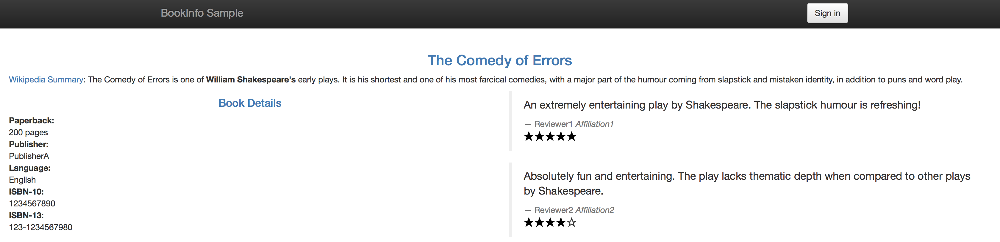
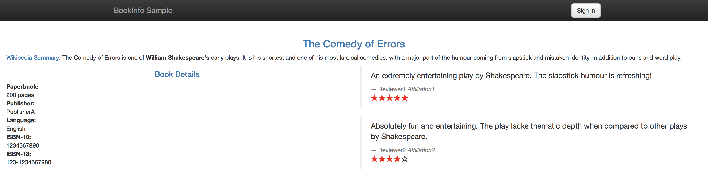
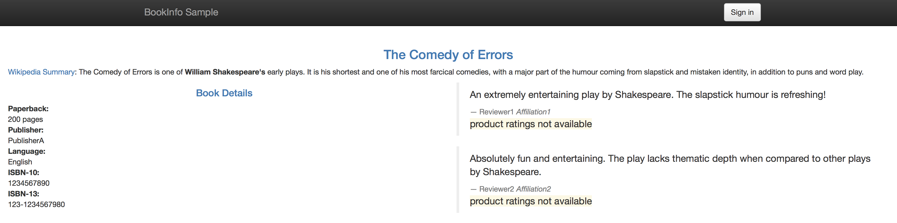
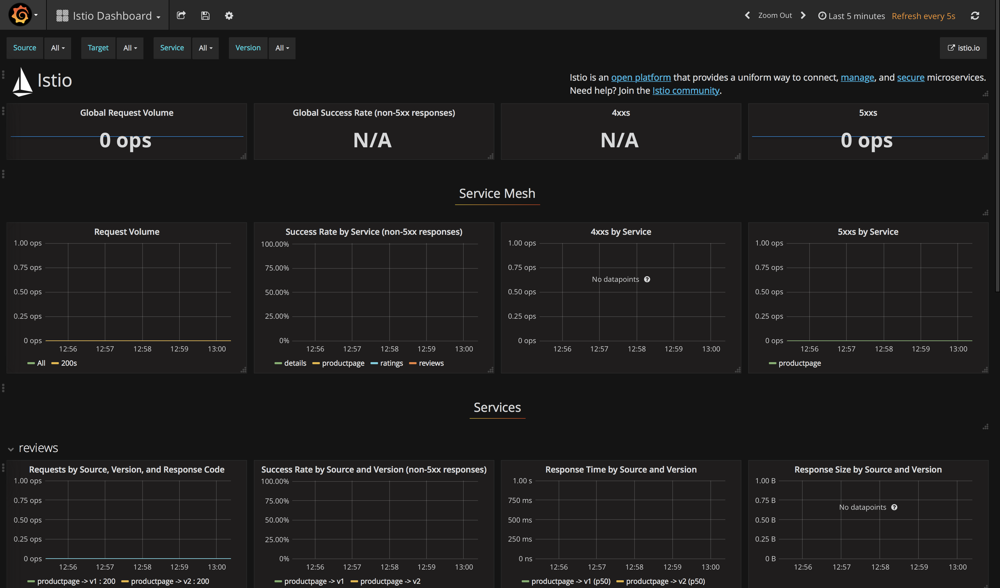
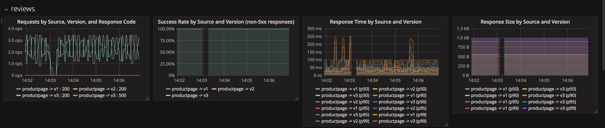
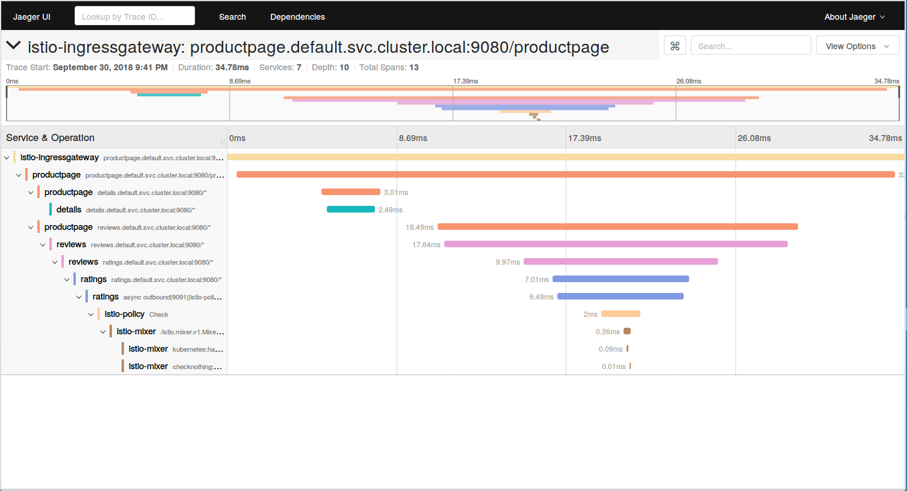
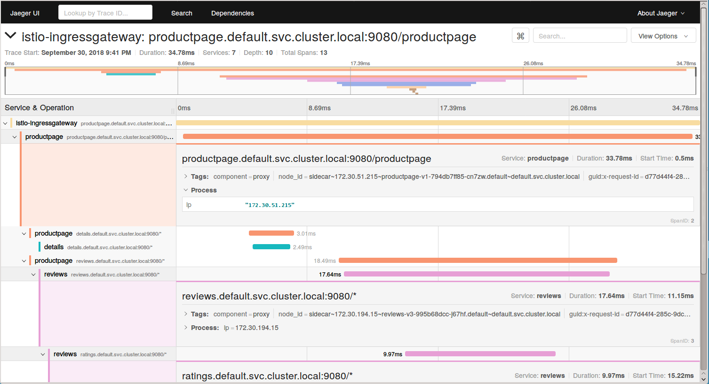

# Modernización de Aplicaciones - Dojo / Lab 1 Istio


<p align="center">
  
</p>


En este laboratorio instalaremos y utilizaremos Istio! 


## Instalacion


En su pc, cree una carpeta  y copie allí todo el contenido de este lab */assets/istio/lab1/* En mi caso la llamare istiorepo.


Ahora necesitamos  instalar Istio en nuestro clúster de Kubernetes. Estos son los pasos (asegúrese de cambiar la versión a la descargada):


```
$ curl -L https://git.io/getLatestIstio | sh -
$ mv istio-<versión> istio # reemplaza con la versión descargada 
$ ibmcloud login -a https://api.ng.bluemix.net #Si tienes un ID federado, usa ibmcloud login --sso 
$ ibmcloud ks region-set <region>  # us-south 
$ ibmcloud ks cluster-config <nombre-clúster>  # mycluster 
$ kubectl get nodes # verificar la conexión 
$ kubectl apply -f istio/install/kubernetes/ istio-demo.yaml
```


## Introduccion 


Implementaremos una aplicación "Bookinfo" de muestra e inyecta sidecars de Istio para permitir la gestión del flujo de tráfico, las políticas de acceso y la agregación de datos de monitoreo para la aplicación.


## 1 - Desplegando la aplicación BookInfo con el sidecar Istio inyectado


En esta parte, utilizaremos la aplicación BookInfo, que viene con Istio de ejemplo. La aplicación se compone de cuatro microservicios, escritos en diferentes idiomas para cada uno de sus microservicios, estos son, Python, Java, Ruby y Node.js. La aplicación predeterminada no utiliza una base de datos y todos los microservicios almacenan sus datos en el sistema de archivos local. Los Envoys se despliegan como sidecars en cada microservicio. Inyectar Envoy en su microservicio significa que el sidecar Envoy administraría las llamadas entrantes y salientes para el servicio. Para inyectar un sidecar Envoy en una configuración de microservicio existente, haga lo siguiente:


```
$ kubectl apply -f <(./istio/bin/istioctl kube-inject -f istio/samples/bookinfo/platform/kube/bookinfo.yaml)
```


> `istioctl kube-inject` modifica el archivo yaml pasado en -f. Esto inyecta el sidecar de Envoy en la configuración de recursos de Kubernetes. Los únicos recursos actualizados son Job, DaemonSet, ReplicaSet e Deployment. Otros recursos en la configuración del archivo YAML no se modificarán.


Después de unos minutos, debería de tener sus  Pods funcionando y ademas un sidecar Envoy en cada uno de ellos junto con el microservicio. Los microservicios: página de productos, detalles, calificaciones y reseñas. Tenga en cuenta que tendrá tres versiones reseñas.


```
$ kubectl get pods


NAME                                        READY     STATUS    RESTARTS   AGE
details-v1-1520924117-48z17                 2/2       Running   0          6m
productpage-v1-560495357-jk1lz              2/2       Running   0          6m
ratings-v1-734492171-rnr5l                  2/2       Running   0          6m
reviews-v1-874083890-f0qf0                  2/2       Running   0          6m
reviews-v2-1343845940-b34q5                 2/2       Running   0          6m
reviews-v3-1813607990-8ch52                 2/2       Running   0          6m
```


Creemos un gateway para acceder a los servicios a través de una dirección IP pública.


```
kubectl apply -f  istio/samples/bookinfo/networking/bookinfo-gateway.yaml
```


Para acceder a su aplicación, puede verificar la dirección IP pública de la misma con el siguiente comando. Tenga en cuenta que la dirección IP también será diferente para su clúster.


```bash
$ export GATEWAY_URL=$(ibmcloud ks workers <cluster-name> | grep normal | awk '{print $2}' | head -1):$(kubectl get svc istio-ingressgateway -n istio-system -o jsonpath={.spec.ports[0].nodePort}) #mycluster
        
$ echo 'Access your application via: http://'$GATEWAY_URL'/productpage' 
Access your application via: http://169.55.105.75:31380/productpage

```


Si actualiza la página varias veces, verá que la sección de reseñas de la página cambia. Esto se debe a que hay 3 versiones de implementación de reseñas (reviews-v1, reviews-v2, reviews-v3) para nuestro servicio de reseñas . El equilibrador de carga de Istio está utilizando un algoritmo round-robin para recorrer las 3 instancias de este servicio






## 2 -  Gestión del flujo de tráfico con Istio Pilot - Modificar rutas de servicio


En esta sección, Istio se configurará para modificar dinámicamente el tráfico de red entre algunos de los componentes de nuestra aplicación. En este caso, tenemos 2 versiones del componente "reviews" (v1 y v2) pero no queremos reemplazar review-v1 con review-v2 inmediatamente. En la mayoría de los casos, cuando se actualizan los componentes, es útil implementar la nueva versión, pero solo tiene un pequeño subconjunto de tráfico de red enrutado para que pueda probarse antes de eliminar la versión anterior. Esto a menudo se conoce como "canary testing".


Hay varias formas en que podemos controlar este enrutamiento. Se puede basar en el usuario o tipo de dispositivo que está accediendo a él, o se puede configurar un cierto porcentaje del tráfico para que fluya a una versión.


Este paso le muestra cómo configurar dónde desea que vayan sus solicitudes de servicio en función de los pesos y los encabezados HTTP. Debería estar en el directorio raíz de la versión Istio que ha descargado en la sección Requisitos previos.


* Reglas de destino


Antes de continuar, tenemos que definir las reglas de destino. Las reglas de destino le dicen a Istio qué versiones (subconjuntos en la terminología de Istio) están disponibles para el enrutamiento. Este paso es necesario antes de que sea posible la conformación de tráfico de grano fino.


```
kubectl apply -f istio/samples/bookinfo/networking/destination-rule-all.yaml
destinationrule.networking.istio.io/productpage created
destinationrule.networking.istio.io/reviews created
destinationrule.networking.istio.io/ratings created
destinationrule.networking.istio.io/details created
```


* Establecer rutas predeterminadas a *reviews-v1* para todos los microservicios


Esto establecerá todas las rutas entrantes en los servicios (indicados en la línea ```destination: <service>)``` para el despliegue con una etiqueta *version: v1*. Para establecer las rutas predeterminadas, ejecute:


```
$ kubectl apply -f istio/samples/bookinfo/networking/virtual-service-all-v1.yaml 
```


* Establecer ruta a *reviews-v2*  para un usuario específico


Esto establecería la ruta para el usuario *jason* (puede iniciar sesión como *jason* con cualquier contraseña en su aplicación web de implementación)


```
$ kubectl apply -f samples/bookinfo/networking/virtual-service-reviews-test-v2.yaml 
```


* Dirige el 50% del tráfico hacia *reviews-v1* y el 50% hacia *reviews-v3*.


Esto se indica mediante ```weight: 50``` en el archivo yaml.


```
$ kubectl apply -f samples/bookinfo/networking/virtual-service-reviews-50-v3.yaml 
```


* Dirige el 100% del tráfico a la version v3 de las reseñas


```
$ kubectl apply -f samples/bookinfo/networking/virtual-service-reviews-v3.yaml 
```


## 3 - Política de acceso con Istio Mixer: configurar el control de acceso


Este paso le muestra cómo controlar el acceso a sus servicios. Ayuda a restablecer las reglas de enrutamiento para garantizar que estamos comenzando con una configuración conocida. Los siguientes comandos primero establecerán todas las solicitudes de revisión en v1, y luego aplicarán una regla para enrutar las solicitudes del usuario user a v2, mientras que todos los demás irán a v3:


 ```
$ kubectl apply -f samples/bookinfo/policy/mixer-rule-deny-label.yaml
$ kubectl apply -f samples/bookinfo/policy/mixer-rule-ratings-denial.yaml
 ```


Ahora verá que sus las estrellas en la pagina de productos están siempre rojas en la sección de reseñas si no está conectado, y siempre muestra estrellas negras cuando está conectado como *jason*.


* Para denegar el acceso al servicio de calificaciones para todo el tráfico proveniente reviews-v3, deberá aplicar estas reglas:


```
$ kubectl apply -f samples/bookinfo/networking/virtual-service-all-v1.yaml
$ kubectl apply -f samples/bookinfo/networking/virtual-service-reviews-jason-v2-v3.yaml
```


* Para verificar si su regla se ha aplicado, vaya a su aplicación BookInfo. Notarás que no ves estrellas en la sección de reseñas a menos que hayas iniciado sesión como *jason* , en cuyo caso verás estrellas negras.





## 4 - Agregación de datos de telemetría con Istio Mixer: recopile métricas y registros


EN este paso veremos cómo configurar Istio Mixer para recopilar telemetría para los servicios en nuestro clúster.


* Verifique que los complementos necesarios de Istio (Prometheus y Grafana) estén disponibles en su clúster:
 
```
$ kubectl get pods -n istio-system | grep -E 'prometheus|grafana'
grafana-6cbdcfb45-bwmtm                     1/1       Running     0          4d
istio-grafana-post-install-h2dgz            0/1       Completed   1          4d
prometheus-84bd4b9796-vnb58                 1/1       Running     0          4d
```


Para recopilar nuevos datos de telemetría, aplicará una regla de mixer. Para esta muestra, generará registros para el servicio *Size* de respuesta para reseñas. El archivo YAML de configuración se proporciona dentro de la carpeta de BookInfo.


* Cree la configuración en Istio Mixer usando la configuración en *new-metrics-rule.yaml*


```
$ kubectl apply -f new-metrics-rule.yaml 
metric.config.istio.io/doublerequestcount created
prometheus.config.istio.io/doublehandler created
rule.config.istio.io/doubleprom created
logentry.config.istio.io/newlog created
stdio.config.istio.io/newhandler created
rule.config.istio.io/newlogstdio created
metric.config.istio.io/doublerequestcount unchanged
prometheus.config.istio.io/doublehandler unchanged
rule.config.istio.io/doubleprom unchanged
logentry.config.istio.io/newlog unchanged
stdio.config.istio.io/newhandler unchanged
rule.config.istio.io/newlogstdio unchanged
```


* Verifique que su tablero de Grafana esté listo. Obtenga la IP de su clúster  ```ibmcloud cs workers <your-cluster-name>```y luego el NodePort de su servicio Grafana ```kubectl get svc | grep grafana``` o puede ejecutar el siguiente comando para generar ambos:


```
$ kubectl -n istio-system port-forward $ ( kubectl -n istio-system get pod -l app = grafana -o jsonpath = ' {.items [0] .metadata.name} ' ) 3000: 3000
```


Ahora vaya en su navegador a [http://localhost:3000](http://localhost:3000)


Su tablero debería verse así:





* Envíe tráfico a ese servicio actualizando en su navegador http://${GATEWAY_URL}/productpage varias veces.


* Verifique que la nueva métrica se esté recopilando. El gráfico de la derecha ahora debe rellenarse.





### 4.2 - Recopilar seguimientos de solicitudes con Jaeger


Jaeger es una herramienta de rastreo distribuida que está disponible con Istio.


* Acceda a su Panel de control de Jaeger configurando el reenvío de puertos al pod de Jaeger con este comando:


```
$ kubectl port-forward -n istio-system $ ( kubectl get pod -n istio-system -l app = jaeger -o jsonpath = ' {.items [0] .metadata.name} ' ) 16686: 16686
```


Acceda al panel de Jaeger [http://localhost:16686](http://localhost:16686)


Su tablero debería tener este aspecto: 


  


* Envíe tráfico a ese servicio actualizando  http://${GATEWAY_URL}/productpage varias veces.


* Vaya a su Panel de Jaeger nuevamente y verá una serie de seguimientos realizados. Haga clic en el botón *Find Traces* para ver los rastros recientes (hora anterior por defecto).





* Haga clic en uno de esos traces y verá los detalles del tráfico que envió a su aplicación BookInfo. Muestra cuánto tiempo se tardó en finalizar la solicitud. 





## Cierre del lab


Esto a sido todo, en este lab pudimos poner en práctica muchos de los conceptos de Istio que vimos en la sección anterior. 
Si desea eliminar Istio de su cluster puede ejecutar el siguiente comando:
```
$ kubectl delete -f istio/install/kubernetes/istio-demo.yaml
```


Para eliminar BookInfo ejecute: 


```
./samples/bookinfo/platform/kube/cleanup.sh
```
