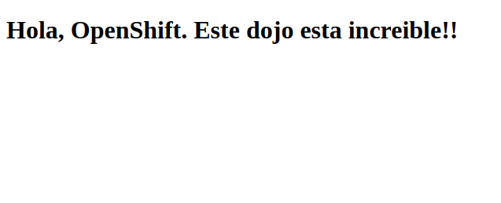

# Modernización de Aplicaciones / Lab 1 OpenShift


<p align="center">
  
</p>


## Crear una Aplicación y desplegarla en Openshift


En este laboratorio veremos como crear una aplicación y desplegar en nuestro cluster de OpenShift. Realizaremos todo el laboratorio utilizando la consola web y haremos uso de Source to Image, es decir que en vez de proporcionar la imagen de nuestra aplicación solo vamos a brindar el código por medio de un repositorio Git. 


### Subir el código a Github


En este laboratorio crearemos un repositorio en github pero usted puede utilizar cualquier otra plataforma. Lo primero que debemos hacer es crear un repositorio y subir allí el código que se encuentra en la carpeta /code. Luego  copie la ruta del repositorio ya que la va a necesitar para el despliegue. En mi caso es:


```
https://github.com/jpanizza/book-helloworld
```


### Crear un proyecto


¿Recuerda cuando el la sección anterior hablamos de los proyectos en OpenShift? Ahora vamos a crear un proyecto en nuestro cluster para hacer allí el despliegue de la aplicación. 


Lo primero que debemos hacer es acceder a nuestra consola web, para ello debemos dirigirnos al servicio desde IBM Cloud y una vez allí hacer clic sobre "OpenShift Web Console".


<p align="center">
  
</p>


Una vez se haya cargado la consola web verá en el panel lateral derecho la lista de sus proyectos, allí hagamos clic en "Create Project". Se desplegará un menú en el cual debe completar con los datos de su proyecto (como se puede apreciar en la imagen de aquí debajo). Por último haga clic en "Create"


<p align="center">
  
</p>


A continuacion sera redireccionado a la vista del proyecto desde donde podremos gestionar todo lo relacionado al mismo. 


<p align="center">
  
</p>


### Desplegar la aplicación


Lo que haremos ahora sera desplegar el código de nuestra aplicación usando WildFly (ya viene instalado en OC). 
Vayamos a "Catalog" y hagamos clic sobre WildFly. En la primer ventana indiquemos el nombre de nuestra aplicación y el link del repositorio en donde subimos el código. 


<p align="center">
  
</p>


Listo! Eso es todo. Ahora en la siguiente ventana debería ver un mensaje como el siguiente:


<p align="center">
  
</p>


Vayamos a "Overview" en el panel lateral izquierdo, allí veremos el estado de nuestra aplicación, la cual en un principio dirá "Build <NUMBER> is running" como se muestra a continuación:


<p align="center">
  
</p>


Esto significa que OpenShift está creando la imagen de nuestra aplicación en base al código de github para poder desplegarla. Luego de este proceso, si no ocurrieron errores, deberíamos de ver lo siguiente:


<p align="center">
  
</p>


En esta pestaña podemos observar varios detalles de nuestra aplicación, por ejemplo el nombre de la imagen, el del build, el puerto interno y la ruta para acceder a nuestra aplicación. También se indica la cantidad de pods que tiene nuestro despliegue, y junto a este hay unas flechas para que podamos aumentar o disminuir las réplicas del mismo. Probemos, agreguemos 3 pods más, y luego bajemos el total a 2, vea lo sencillo que es escalar!


Probemos nuestra aplicación, para ello haga clic en el link debajo de "Routes - External Traffic", debería de ver lo siguiente:


<p align="center">
  
</p>


### Actualizar la aplicación


En este caso, para actualizar nuestra aplicación solo basta con actualizar el código en el repositorio, luego le pediremos a OpenShift que realice un nuevo build de la aplicación. 


Realicemos el siguiente cambio:


1 - Abramos el archivo code/src/webapp/index.html y allí cambiamos la línea 9 por lo que queramos. 


En mi caso cambiare esto:


```html
<h1>Hola, OpenShift. Este dojo esta increíble!!</h1>
```


Por esto:


```html
<h1>Aprendí a actualizar mis aplicaciones!!</h1>
```


2 - Subamos los cambios a nuestro repositorio


```
$ git commit -m "actualización"
```
y luego


```
$ git push
```
3 - Vayamos a "Builds" en el menú lateral izquierdo en la consola de OpenShift (dentro del proyecto):


<p align="center">
  
</p>


Luego hagamos clic sobre el nombre del build que corresponda con la aplicación que anteriormente desplegamos, si tiene varios puede ver en donde dice "Source" cual coincide con el repositorio donde acaba de realizar los cambios.


Una vez allí debemos hacer clic en "Start Build" para que OpenShift vuelva a generar una imagen con el código de nuestro repositorio. 


<p align="center">
  
</p>


Una vez que se haya generado y desplegado la nueva imagen si volvemos a acceder a nuestra aplicación veremos que estamos accediendo a la nueva versión


<p align="center">
  
</p>

Felicitaciones!! Completo el lab1 de OpenShift. 
